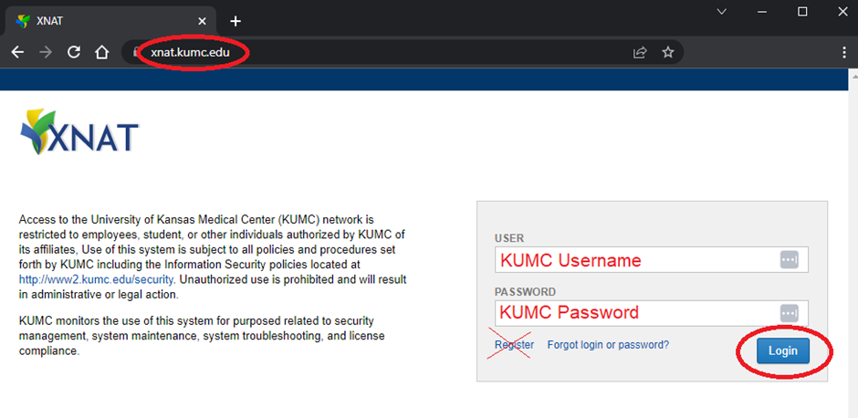

Synapse Server Access
======================

.. _synapse_request_access:

Requesting Access
-----------------------

Submit an `access request <https://redcap.kumc.edu/surveys/?s=R7PCHA3PNL>`_ for yourself or others for Synapse, the VPN (required for Non-KUMC/KU-L users or KUMC students), or R/P Network drives.

.. _synapse_access:

Accessing Synapse
------------------------

Windows
----------------------

#. Install `MobaXterm <https://mobaxterm.mobatek.net/download-home-edition.html>`_ or your preferred SSH client. If you do not have software installation rights on your PC, you may use the Portable edition which contains a stand-alone .exe file that does not need to be installed. Otherwise, select the Installer edition.
#. Open MobaXterm and configure a new session. Select SSH, ensure X11-Forwarding is checked, and enter the following information:
    * Remote Host: hbic-synapse2.kumc.edu
    * Username: <your KUMC username> **Note: admins need to login with their sa-USERNAME account**

he field Remote host is circled and contains the text "hbic-synapse2.kumc.edu". A red circle is drawn around the specify username field. The filed is checked and contains an example username, a123b456. In the panel below, the "Advanced SSH settings" tab is selected. A red circle is drawn around the option X-11 forwarding, and this option is checked.

