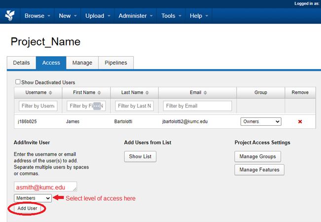

XNAT Data Management
==============================

.. _xnat_account:

Creating an XNAT account
-----------------------------

While on the KUMC/KU-L network or VPN, go to https://xnat.kumc.edu and login with your KUMC credentials (do not use the register button)

.. image:: media/xnat_account_1.png
  :width: 800
  :alt: A screenshot of the homepage of xnat.kumc.edu.  There is a login box with fields for user and password, and buttons for Register, Forgot login or password, and Login. KUMC Username is written in the User field. KUMC Password is written in the password field. An X is hand-drawn through the register button. A hand-drawn circle is around the login button.

On the next page, link your LDAP account (that is, your KUMC account) with a New XNAT Account. On the right hand pane, name your XNAT account FirstInitialLastname (you'll still always sign in with your KUMC account, this XNAT username is only used internally by the application), provide your name and email, and submit. 

.. image:: media/xnat_account_2.png
  :width: 800
  :alt: A screenshot of the new account page of xnat.kumc.edu.  Under the title, "Connect your LDAP Account with an XNAT Account" are buttons to merge your LDAP account with 1) A New XNAT Account and 2) An Existing XNAT Account. Option 1 is circled. A panel on the right titled Register a New Account has several fields with example text filled in. The fields and their contents are: 1) Username, asmith 2) First Name, Alex 3) Last Name, Smith 4) Email, asmith@kumc.edu, 5) Phone, blank, 6) Study Site or Lab, blank.

.. _xnat_project:

Joining an XNAT project
-----------------------------

If you are joining an existing project, ask a project owner to invite you from the project’s access page and assign your level of access.

with the example text "asmith@kumc.edu" in red font. Below that is a drop-down selector currently set to Members. Pointing at the dropdown menu is an annotation in Red text that reads, "Select level of access here". Below that is a button, Add User, with a red circle around it.

If you are instead joining a new project, contact Hoglund staff for assistance creating a new project. This step is normally completed by Hoglund staff after a project initiation meeting or before a technique development scan.
