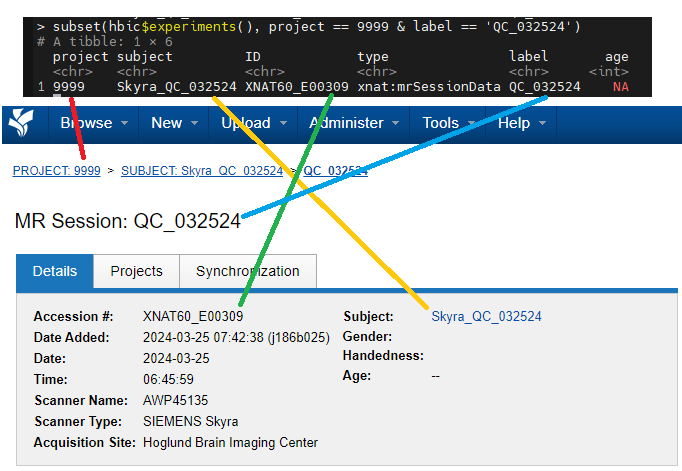

XNAT API
==============================

.. _xnat_api:

`XNAT has an API <https://wiki.xnat.org/xnat-api/>`_ for command line querying and interacting with data contained in XNAT.

There are several tools built on top of the API in different programming languages, including Rxnat, pyxnat, and xnatpy.

Rxnat
-----------------------------

`Rxnat <https://neuroconductor.org/tutorials/rxnat>`_ is an R package to facilitate connecting to, querying, and downloading from XNAT.  

It is installed for all users on Synapse. Elsewhere, you can install Rxnat from neuroconductor with:

.. code-block:: console

   library(neurocInstall)
   source("http://neuroconductor.org/neurocLite.R")
   neuro_install("Rxnat", release = "stable")

Alternatively, you can install it from GitHub with:

.. code-block:: console

   # install.packages("remotes") # Uncomment this line to install the 'remotes' package if you get an error on the following line
   remotes::install_github("neuroconductor/Rxnat")

Rxnat Usage
-------------------------

First, connect to and authenticate with xnat. **DO NOT** save your password in your scripts directly. Instead, request the username and password interactively at runtime. The `getPass` library is already installed on Synapse. On a local computer, first install it with `install.packages('getPass')`

.. code-block:: console

   hbic <- xnat_connect('https://xnat.kumc.edu', username = readline('XNAT Username: '), password = getPass::getPass('XNAT Password: '))

There are four levels of data structure that you can access with Rxnat:

- **Project**: A single research study containing multiple subjects. 
- **Subject**: A grouping for an individual, they may have multiple datasets associated with them.
- **Experiment**: A single dataset assigned to an individual subject. Each scanning session is sent to XNAT as an individual experiment.
- **Resource**: A single file in an experiment. Each DICOM image is a separate resource.

Each level can be queried from Rxnat. The functions ``hbic$projects()``, ``hbic$subjects()``, and ``hbic$experiments()`` (replace hbic with the name of the variable you saved the output of xnat_connect() to). Return tables with information on all projects, subjects, or experiments in XNAT that you have access to. ``hbic$get_xnat_experiment_resources(EXPERIMENT_ID)`` returns a table with all resource files associated with the given experiment. ``EXPERIMENT_ID`` refers to an ID from the ``hbic$experiments()`` table, and is also called the "Accession #" in the XNAT web interface.

To obtain the resource files associated with a particular scan, you will need to provide either the URI (Universal Resource Identifier) for each file, or the ID/Accession# associated with a single Experiment.

Use ``download_xnat_dir()`` to obtain all files associated with an experiment (i.e., scanning session). Data is downloaded as a single .zip file by default. Set `zipped = FALSE` to download as individual files.

.. code-block:: console

   # Location to save downloaded files to
   output_directory <- '~/P-Drive/mystudy/Raw'
   myproject <- '9999'
   # Table of all experiments (scans) in XNAT you have access to.
   exp <- hbic$experiments() 
   # Filter by a project of interest
   exp_myproject <- subset(exp, project == myproject)
   # Download the entire scan session for the first entry in the experiment list to the specified directory. Timeout is set to 600 seconds; download will abort if it does not complete within this time.
   my_id <- exp_myproject$ID[1] 
   download_xnat_dir(hbic, my_id, file_dir = output_directory, timeout_duration = 600)

Use ``download_xnat_file()`` to obtain a single file. Each dicom image is a single file, and as such it would take many function calls to complete a dataset this way. This function is most useful for downloading a combined .nii file or other complete resource. You need to provide a URI for the resource to this function.

.. code-block:: console

   my_resources <- hbic$get_xnat_experiment_resources(my_id)
   download_xnat_file(hbic, my_resources$URI[1], file_dir = output_directory)
